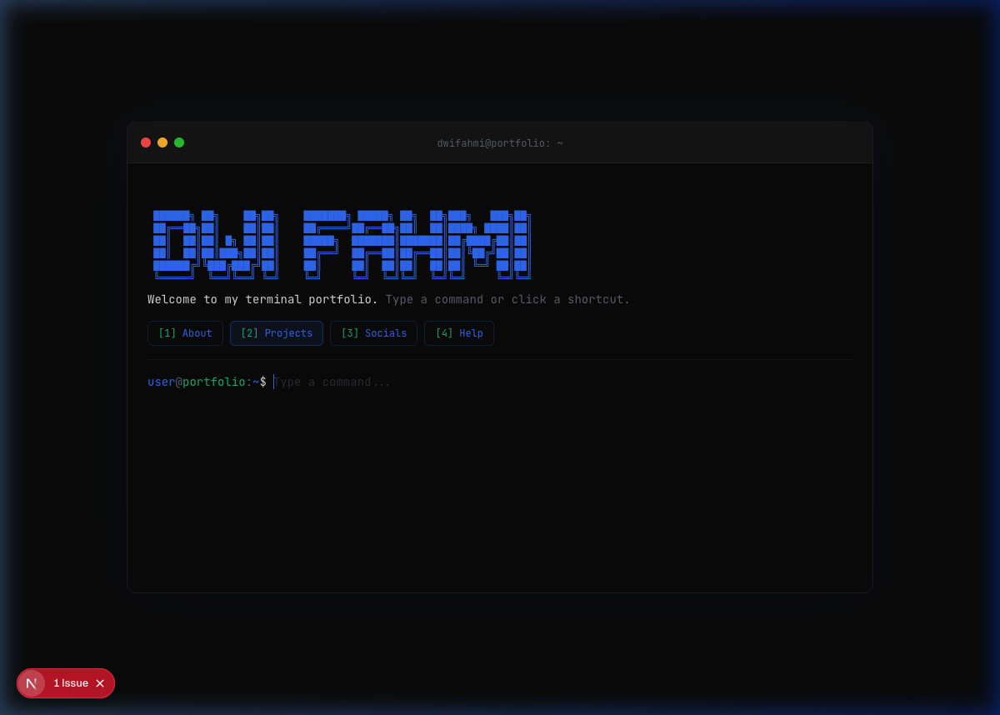
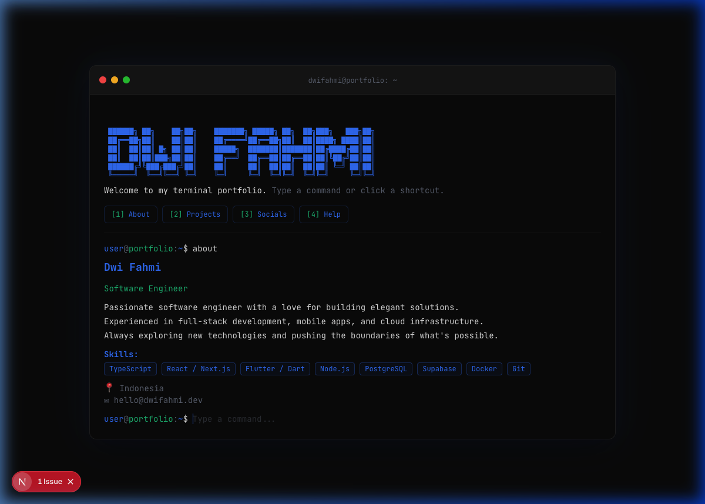
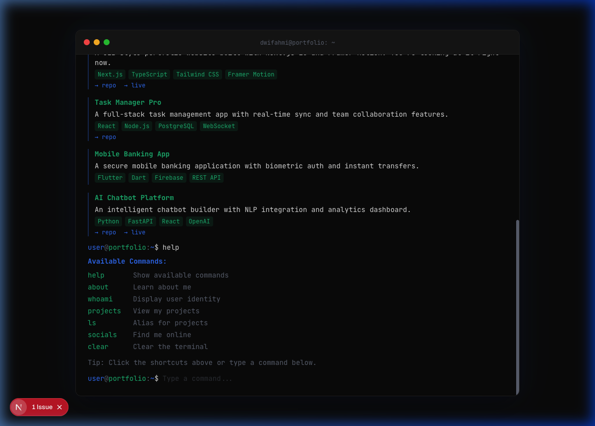
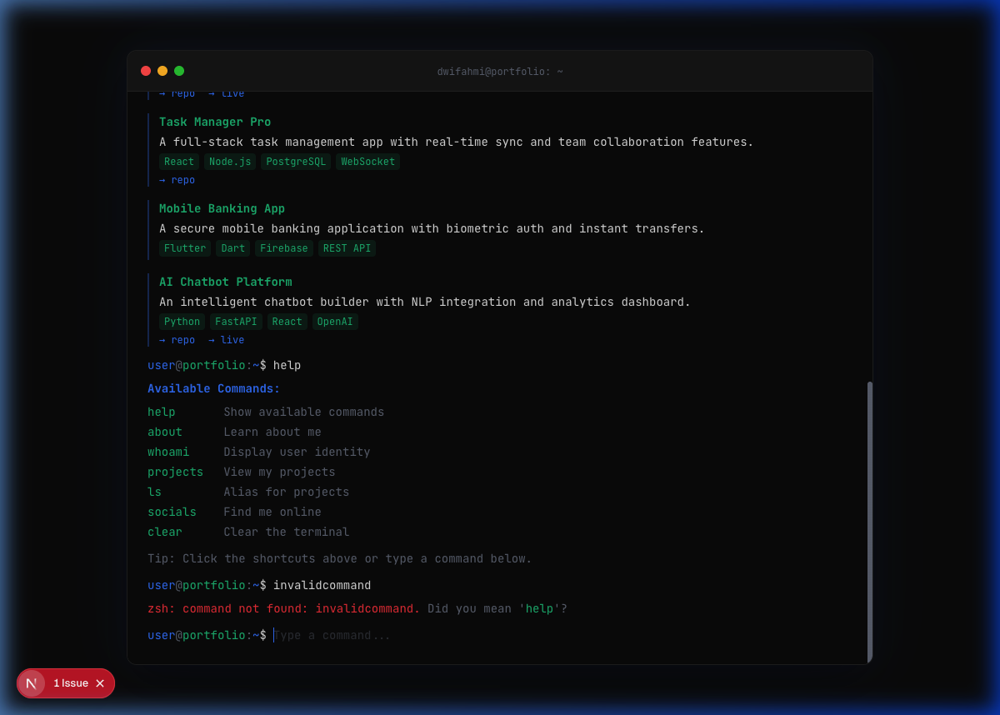
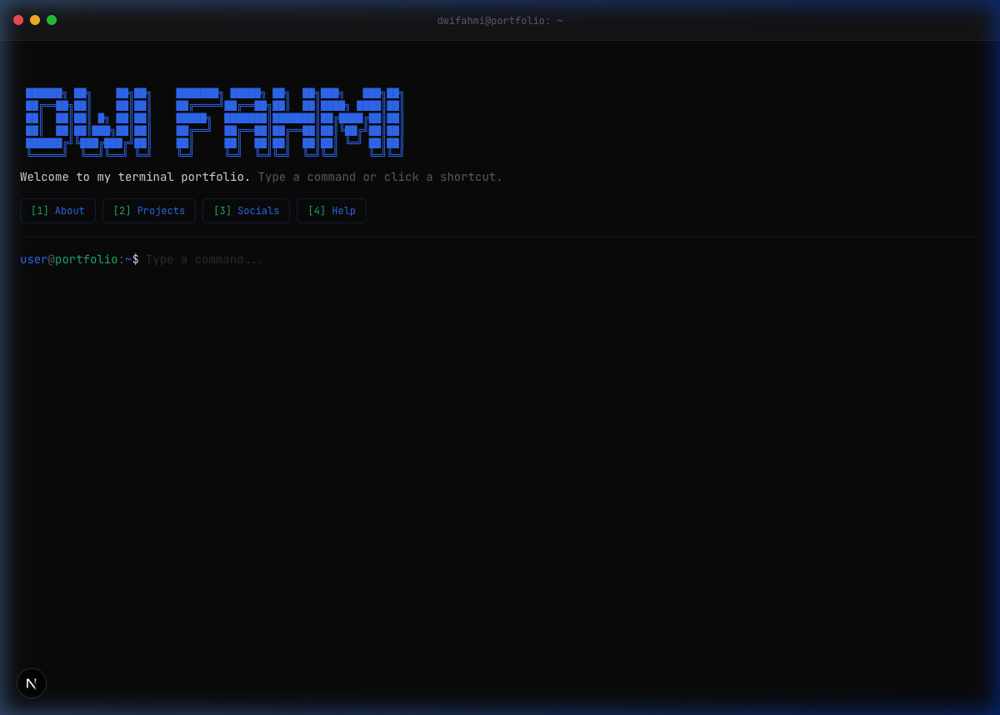

# 🖥️ Terminal Portfolio

A minimalist, high-fidelity portfolio website that replaces traditional UI with a fully functional **Command Line Interface (CLI)**. Inspired by **Claude Code** and **modern developer terminals** — sleek, responsive, and deeply technical, yet accessible through guided options.

> **"Show, don't tell."** The site is a tool the user operates, mirroring a developer's daily environment.

---

## ✨ Screenshots

### Welcome Screen
The terminal boots with a staggered system initialization sequence, then displays an ASCII art banner with clickable shortcut buttons.



### About Command
Displays profile information, skills, location, and contact details.



### Projects & Help
Lists all projects with tech stack tags and repo/live links. The `help` command shows all available commands.



### Error Handling
Unrecognized commands show a friendly `zsh: command not found` message with a hint to try `help`.



### Fullscreen Mode
Click the green traffic light dot to toggle between windowed and fullscreen mode.



---

## 🚀 Features

- **Boot Sequence** — Staggered `[OK]` system messages with Framer Motion animations
- **ASCII Art Banner** — Personalized welcome header
- **7 Commands** — `help`, `about`, `whoami`, `projects`, `ls`, `socials`, `clear`
- **Auto-Suggestions** — Inline ghost text + dropdown as you type, Tab to accept
- **Click-to-Type Shortcuts** — `[1] About`, `[2] Projects`, `[3] Socials`, `[4] Help`
- **Command History** — Arrow Up/Down to cycle through past inputs
- **Fullscreen / Windowed Toggle** — Green dot toggles between modes with smooth animation
- **Error Fallback** — `zsh: command not found` with helpful hints
- **CRT Scanline Overlay** — Subtle retro terminal effect
- **Terminal Glow** — Accent-colored box shadow for that premium feel
- **Auto-scroll** — Terminal always scrolls to the latest output
- **Keyboard-Only Navigation** — Fully usable without a mouse

---

## 🛠️ Tech Stack

| Layer      | Technology                              |
|------------|-----------------------------------------|
| Framework  | [Next.js 15](https://nextjs.org) (App Router) |
| Language   | TypeScript                              |
| Styling    | [Tailwind CSS v4](https://tailwindcss.com)    |
| Animation  | [Framer Motion](https://motion.dev)     |
| Font       | JetBrains Mono (via `next/font/google`) |

---

## 📁 Project Structure

```
src/
├── app/
│   ├── globals.css          # Terminal theme, CRT scanlines, animations
│   ├── layout.tsx           # Root layout with fonts & SEO metadata
│   └── page.tsx             # Main page rendering Terminal
├── components/
│   ├── Terminal.tsx          # Main container: boot → welcome → interactive
│   ├── TerminalHeader.tsx    # macOS traffic light dots + title bar
│   ├── BootSequence.tsx      # Staggered [OK] boot messages
│   ├── CommandLine.tsx       # Input prompt with auto-suggestions
│   ├── CommandOutput.tsx     # Renders command + output pairs
│   ├── TypewriterText.tsx    # Character-by-character text reveal
│   └── AsciiArt.tsx          # ASCII art welcome banner
├── hooks/
│   └── useTerminal.ts        # Terminal state management
├── lib/
│   ├── commands.tsx          # Command registry & handlers
│   └── mockData.ts           # Profile, projects, socials data
└── types/
    └── terminal.ts           # TypeScript type definitions
```

---

## 🏁 Getting Started

### Prerequisites

- Node.js 20+
- npm

### Installation

```bash
# Clone the repository
git clone git@github.com:dwidev/me.git
cd me

# Install dependencies
npm install

# Start the dev server
npm run dev
```

Open [http://localhost:3000](http://localhost:3000) to see the terminal portfolio.

### Build

```bash
npm run build
```

---

## 🎨 Design Tokens

| Token     | Value       | Usage               |
|-----------|-------------|---------------------|
| `--bg`    | `#0A0A0A`   | Deep black background |
| `--text`  | `#E0E0E0`   | Soft white text     |
| `--accent`| `#3B82F6`   | Claude blue highlights |
| `--green` | `#10B981`   | Terminal green      |
| `--error` | `#EF4444`   | Error messages      |
| `--muted` | `#6B7280`   | Subdued text        |

---

## 📄 License

MIT
